# Human Surveillance in Maritime Environments Using Drone Aerial Footage for Search and Rescue

Search and Rescue (SAR) operations in oceans are highly challenging due to vast search regions, unpredictable sea conditions, and the critical need for rapid response. Existing AI models can detect ocean objects such as swimmers and boats, but they often lack the precision and localization capabilities required for effective real-time surveillance and rescue coordination.

Critical Gap:
Current systems fail to accurately:

- Detect and track multiple ocean objects simultaneously.
- Provide precise geo-localization for real-time rescue coordination.

Proposed Solution:
A drone-based AI system designed to:

- Detect and track swimmers, swimmers with life jackets, and boats in real-time.
- Perform geo-localization of detected objects for accurate position mapping.
- Trigger distress alerts when swimmers or swimmers with life jackets are detected and tracked, including:
  - Number of detected objects
  - Snapshot of detected objects
  - Object IDs

## Objectives

- Develop an AI-powered object detection and tracking system for ocean surveillance drones.
- Detect and track swimmers, swimmers with life jackets, and boats in real time.
- Perform geo-localization of detected objects using available sensor and GPS data.
- Trigger automated alerts when swimmers or swimmers with life jackets are detected and tracked, including:
  - Object type and ID
  - Number of detected objects
  - Snapshots of detections
  - Location coordinates
  - Transmit alert data to the control unit to support timely Search and Rescue (SAR) operations.

The following scope diagram illustrates our objectes.

## Scope Diagram

<figure style="text-align:center">
  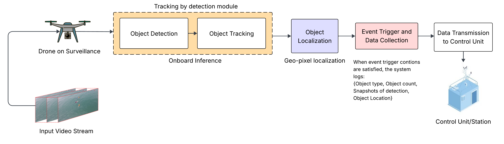
  <figcaption>Scope diagram</figcaption>
</figure>

## Working Model Flow Diagram

<figure style="text-align:center">
  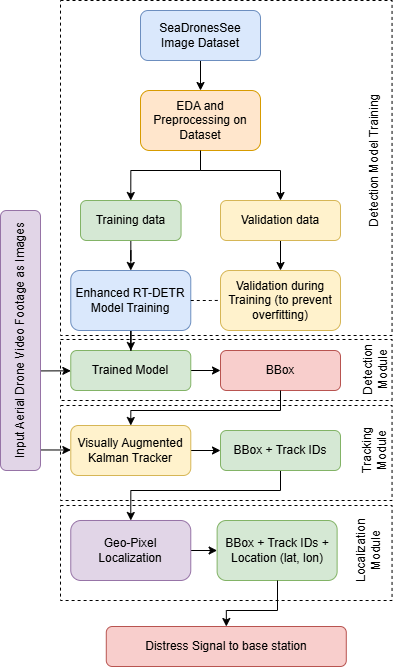
  <figcaption>Working model flow diagram</figcaption>
</figure>

## Data-set Used

Two datasets were used

1. SeaDronesSee (SDS) (Primary)
   - UAV dataset for search & rescue Humans (swimmers) + boats, buoys, life-jacket
   - ~54k annotated images extracted from 22 videos drone videos
   - Useful for detection and tracking
2. MOBDrone (Secondary)
   - 66 Full HD UAV videos (10–60 m altitude)
   - ~126k frames, ~113k human annotations
   - Real sea conditions: waves, reflections, occlusions
   - Ideal for human-only maritime tracking

## Dataset EDA and Preprocessing

Exploratory Data Analysis (EDA) and dataset sampling for the SeaDronesSee dataset were performed in the following notebook:

📄 EDA Notebook:
[seadronessee_dataset_eda.ipynb](detection/notebooks/seadronessee_dataset_eda.ipynb)

The final sampled dataset used for training and evaluation has been uploaded to Kaggle and can be accessed here:

🔗 Kaggle Dataset Link:
https://www.kaggle.com/datasets/rameezakther/seadronessee-mot-sampled-dataset

The MOBDrone dataset is used for inference purpose only so no preprocessing is done.

## Enhanced RT-DETR Model Training and Inferencing

Details about the proposed architecture can be found in the project documentation.

<figure style="text-align:center">
  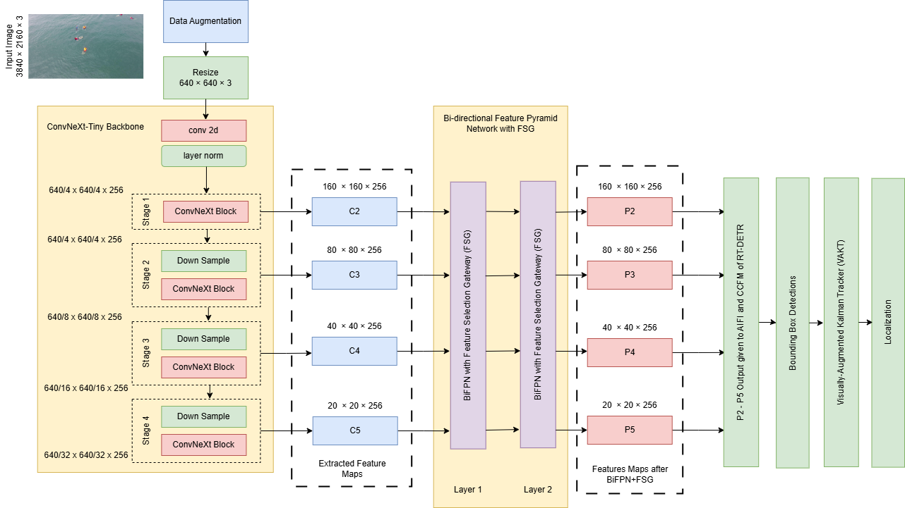
  <figcaption>Enhanced RT-DETR architecture</figcaption>
</figure>

🔧 Model Training

The model was trained using the following Kaggle notebook:

👉 Training Notebook:
https://www.kaggle.com/code/rameezakther/rt-detr-pytorch

The base code is taken from this [repo.](https://github.com/lyuwenyu/RT-DETR)

During training, the Enhanced RT-DETR source code is cloned from this repository.
The source code is located in:

```bash
./detection/src_code
```

All training metrics and comparison results are stored in the detection directory of this repository.

The trained model is publicly available on Kaggle:

👉 Trained Model:
https://www.kaggle.com/models/rameezakther/rt-detr-trained-on-seadronessee-dataset

🖼 Model Inferencing

The trained model was used to run inference on images and video using the below notebook:

👉 Inference Notebook:
https://www.kaggle.com/code/rameezakther/rt-detr-seadronessee-model-inference

Sample images inferred by the trained model are shown below:

<div style="text-align:center">
  <figure style="display:inline-block;margin:8px;text-align:center">
    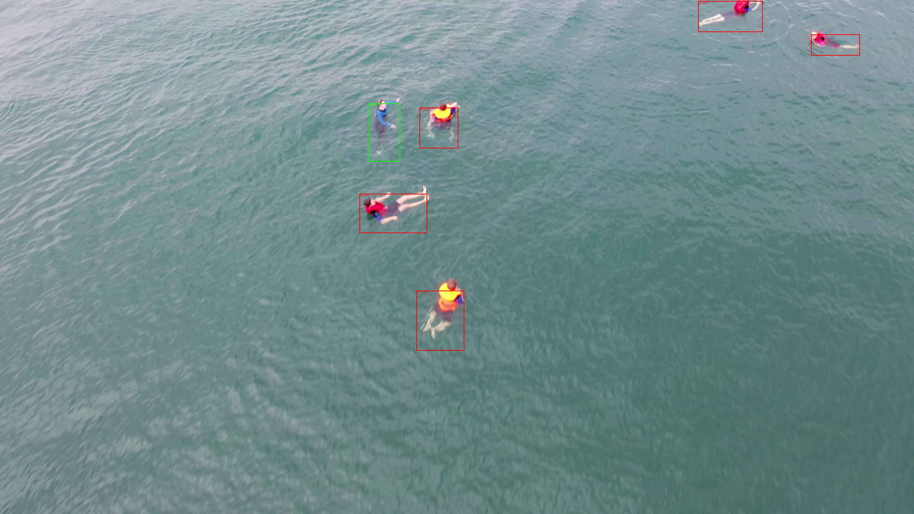
    <figcaption>Inference 1</figcaption>
  </figure>
  <figure style="display:inline-block;margin:8px;text-align:center">
    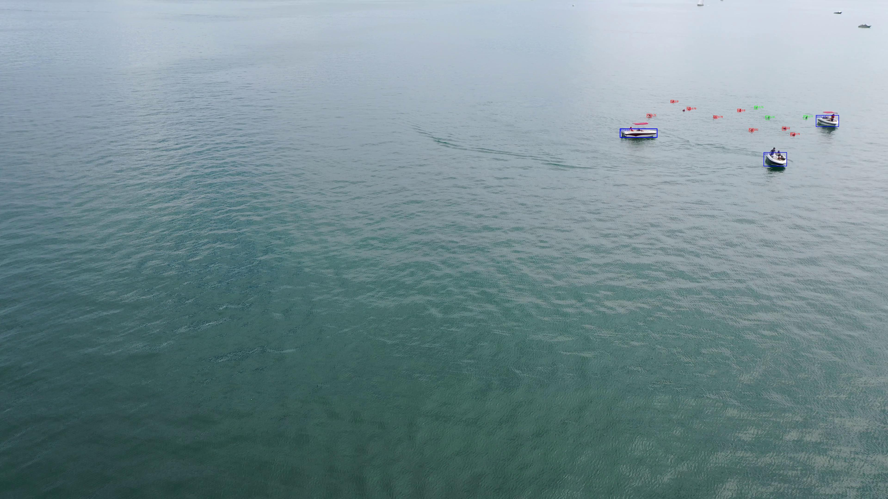
    <figcaption>Inference 2</figcaption>
  </figure>
  <figure style="display:inline-block;margin:8px;text-align:center">
    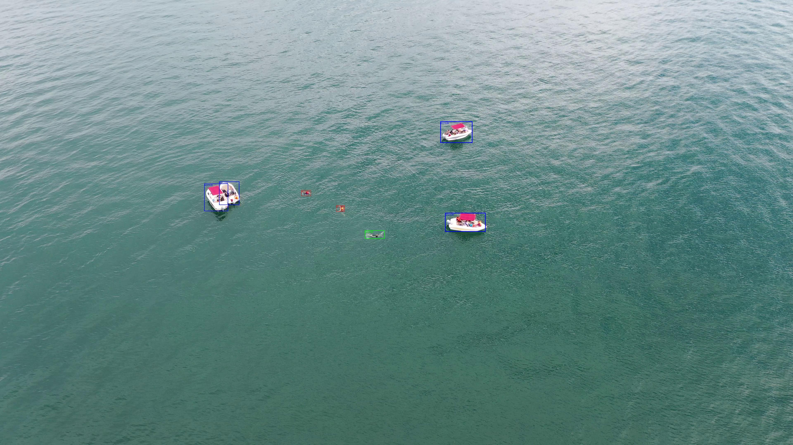
    <figcaption>Inference 3</figcaption>
  </figure>
</div>

## Visually Augmented Kalman Tracker (VAKT)

<figure style="text-align:center">
  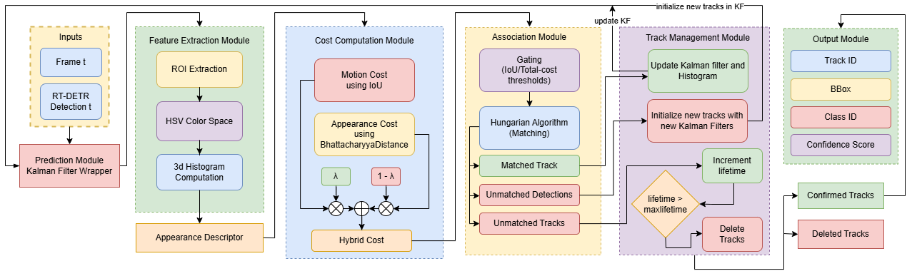
  <figcaption>VAKT architecture</figcaption>
</figure>

The proposed tracking code is present inside the directory:

```bash
.\tracking\src_code
```

The evaluation notebook is present in kaggle:

https://www.kaggle.com/code/suryaks27/tracking

The results and comparative analysis are present in the documentation.

A batch of inferenced images are

<div style="text-align:center">
  <figure style="display:inline-block;margin:8px;text-align:center">
    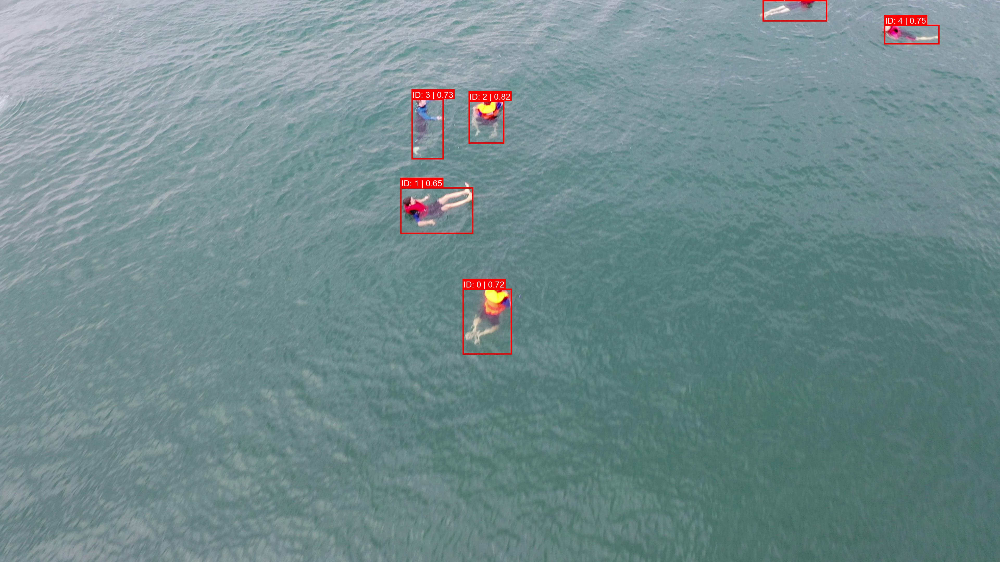
    <figcaption>Tracking inference 1</figcaption>
  </figure>
  <figure style="display:inline-block;margin:8px;text-align:center">
    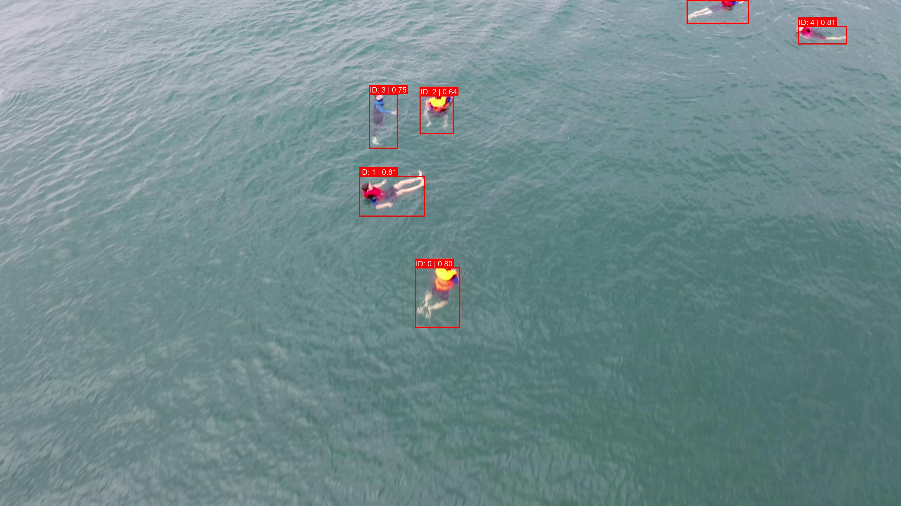
    <figcaption>Tracking inference 2</figcaption>
  </figure>
  <figure style="display:inline-block;margin:8px;text-align:center">
    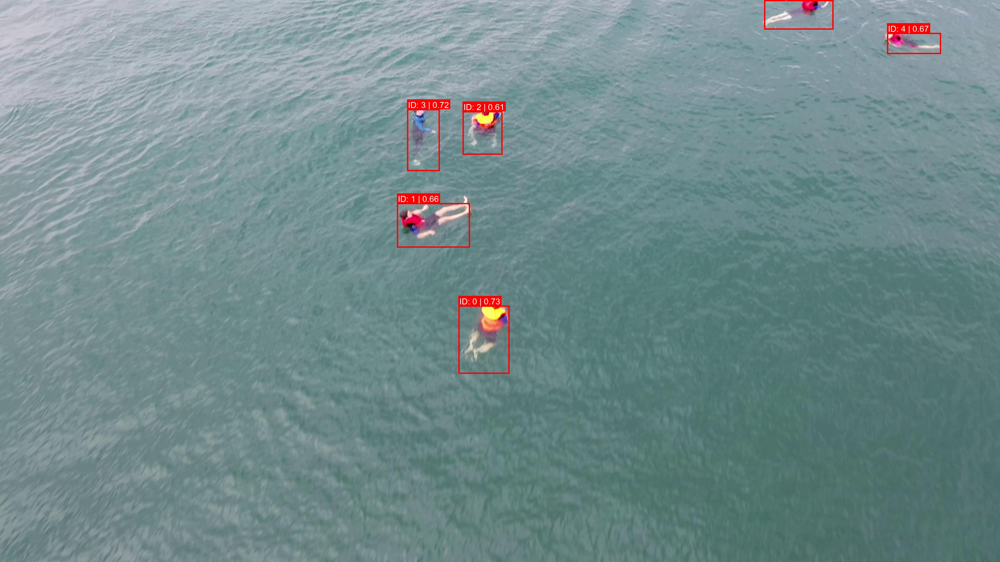
    <figcaption>Tracking inference 3</figcaption>
  </figure>
  <figure style="display:inline-block;margin:8px;text-align:center">
    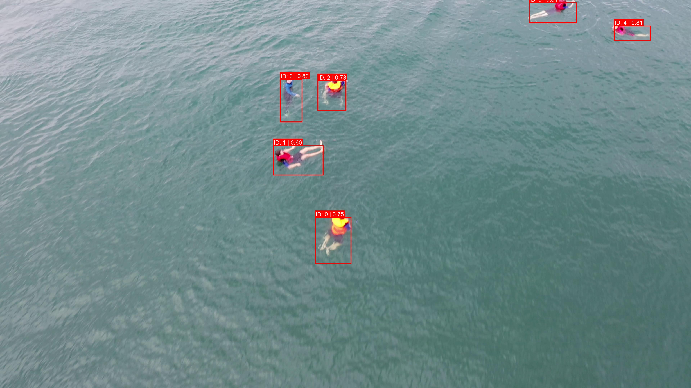
    <figcaption>Tracking inference 4</figcaption>
  </figure>
</div>

## Localization

<figure style="text-align:center">
  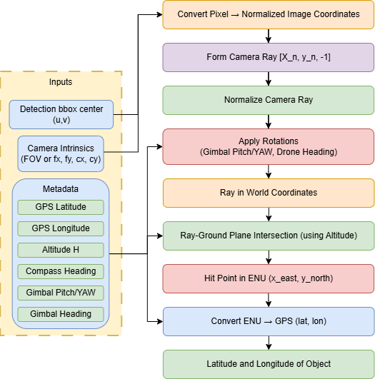
  <figcaption>Architecture of Localization when meta data is available</figcaption>
</figure>

<figure style="text-align:center">
  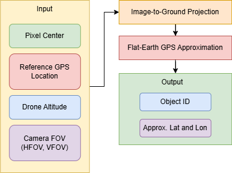
  <figcaption>Architecture of Localization when meta data is not available</figcaption>
</figure>

The first method of implementation is done for seadronessee dataset because meta is available for that dataset. This [notebook](localization/notebook/localization.ipynb) is the implementation of the method1. The method 2 is implemented on video which is from mobdrone dataset since it does not contain any meta data about the drone, and this method is implemented on the final integrated system.

Some of the inferenced images by method are

<div style="text-align:center">
  <figure style="display:inline-block;margin:8px;text-align:center">
    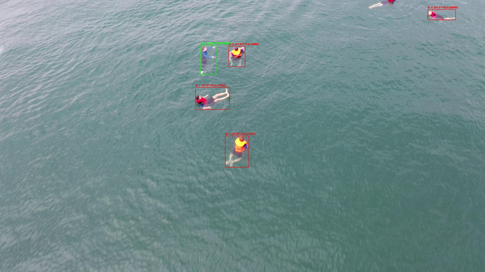
    <figcaption>Localization inference 1</figcaption>
  </figure>
  <figure style="display:inline-block;margin:8px;text-align:center">
    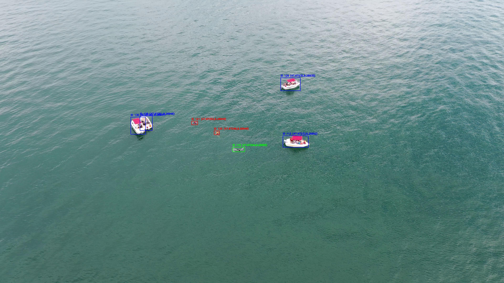
    <figcaption>Localization inference 2</figcaption>
  </figure>
  <figure style="display:inline-block;margin:8px;text-align:center">
    
    <figcaption>Localization inference 3</figcaption>
  </figure>
  <figure style="display:inline-block;margin:8px;text-align:center">
    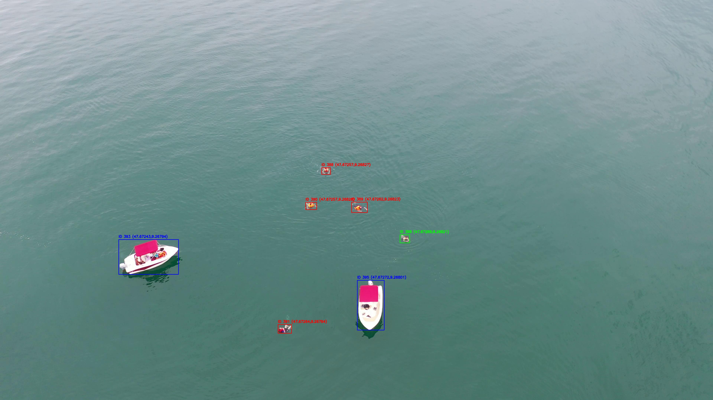
    <figcaption>Localization inference 4</figcaption>
  </figure>
</div>

## Integrated system

The source code present in the `.\integrated_code` directory is an implementation of the full Detection + Tracking + Localization implementation on real time aerial drone footage. In this integrated system method 2 of localization is used, and the final inferenced video can be found in the drive link in the appropriate directory.

## Other links

Drive folder for project [link](https://drive.google.com/drive/folders/1NUXLQBruQClfPWLTbQxhZzHq5ewm8xaV?usp=sharing)
